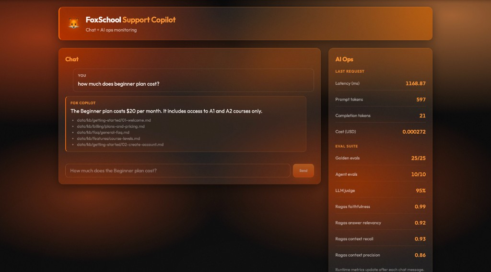

# FoxSchool Support Copilot Dashboard

Full-stack AI ops UI for the [FoxSchool Support Copilot](https://github.com/valtykhoniuk/support-copilot) backend — RAG chat, live request metrics, and eval suite snapshot.

**Live demo (frontend):** https://support-copilot-dashboard.vercel.app  
*(Requires `VITE_API_URL` pointing at a running backend — see [Production deploy](#production-deploy-vercel--ec2).)*



## What it does

| Panel | Data source | Updates |
|-------|-------------|---------|
| **Chat** | `POST /ask` | Every message |
| **Last request** | same response (`latency_ms`, tokens, `cost_usd`) | Every message |
| **Eval suite** | `GET /eval_metrics` | On page load (snapshot from eval scripts) |

The backend agent routes questions to RAG, ticket lookup, or refund tools. Answers include cited KB sources.

## Stack

- React 19 + TypeScript + Vite
- FoxSchool dark glass UI (grain + `backdrop-filter`)
- Backend: FastAPI ([support-copilot](https://github.com/valtykhoniuk/support-copilot))

## Architecture

```
Browser (Vite dev or Vercel)
   │
   ├─ POST /ask          → runtime metrics → Dashboard
   └─ GET /eval_metrics  → eval snapshot   → Dashboard

Local dev:  /api/*  ──proxy──►  localhost:8000
Production: VITE_API_URL ──────►  EC2 / Docker API (+ CORS)
```

## Local development

**1. Backend** (separate repo):

```bash
cd support-copilot
colima start                    # if using Colima on Mac
docker-compose up --build -d
curl http://localhost:8000/health
```

**2. Dashboard:**

```bash
cd support-copilot-dashboard
npm install
npm run dev
```

Open http://localhost:5173 — Vite proxies `/api` → `http://localhost:8000` (see `vite.config.ts`).

No `.env` needed locally.

## Production deploy (Vercel + EC2)

### Backend

1. Deploy API with Docker on EC2 (see [support-copilot README](https://github.com/valtykhoniuk/support-copilot#aws-ec2-cloud)).
2. Rebuild after CORS change: `docker-compose up --build -d`
3. Security group: port **8000** open to `0.0.0.0/0` (demo) or restrict as needed.
4. Note the public IP: `curl http://PUBLIC_IP:8000/health`

Optional: restrict CORS on the API:

```bash
CORS_ORIGINS=https://your-app.vercel.app
```

Default is `*` (fine for portfolio demos).

### Frontend (Vercel)

1. Push this repo to GitHub.
2. [Import project on Vercel](https://vercel.com/new) → select `support-copilot-dashboard`.
3. **Environment variable** (required for production):

   | Name | Value |
   |------|--------|
   | `VITE_API_URL` | `http://PUBLIC_IP:8000` |

4. Deploy. Build command: `npm run build`, output: `dist`.

Or via CLI:

```bash
npm i -g vercel
vercel
# set VITE_API_URL in Vercel dashboard → Settings → Environment Variables
```

**Note:** EC2 is stopped when not demoing — start the instance and update `VITE_API_URL` if the public IP changes.

## Eval metrics snapshot

Eval numbers come from `support-copilot/data/eval_metrics.json`, updated when you run:

```bash
python evals/run_evals.py      # golden_rag
python evals/agent_evals.py    # golden_agent
python evals/model_graded.py   # llm_judge
python evals/ragas_eval.py     # ragas (slow, local)
```

Then rebuild the Docker image so `/eval_metrics` serves the new file.

## Project structure

```
src/
  components/Chat.tsx       # chat + onAskComplete(metrics)
  components/Dashboard.tsx  # runtime + eval panels
  entities/types.ts         # AskResponse, RuntimeMetrics, EvalMetrics
  lib/api.ts                # apiUrl() — proxy vs VITE_API_URL
```

## Related

- Backend repo: [support-copilot](https://github.com/valtykhoniuk/support-copilot)
- Golden evals: **25/25** · Agent: **10/10** · LLM judge: **95%** · Ragas recall: **0.93**
